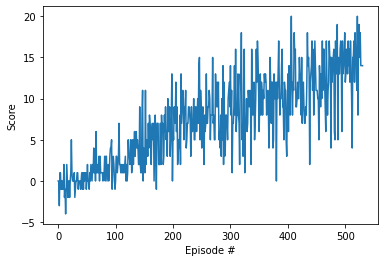

# Unity Banana Collector

### 1. Introduction
This project is part of Udacity Deep Reinforcement Nanodegree. The objective of this project is to apply Deep Q Network (DQN) algorithm to solve the Unity Banana Collector environment. 

In this Banana Collector environment, the goal is to train an agent to navigate and collect bananas in a large, square world. A reward of +1 is provided for collecting a yellow banana, and a reward of -1 is provided for collecting a blue banana. Thus, the goal of the agent is to collect as many yellow bananas as possible while avoiding blue bananas. In order to solve the environment, the agent must get an average score of +13 over 100 consecutive episodes.

### 2. Learning Algorithm
In Deep Q Network ("DQN") ([Mnih et al., 2015](https://storage.googleapis.com/deepmind-data/assets/papers/DeepMindNature14236Paper.pdf)), a deep neural network is used as a function appproximator. The DQN is designed to produce all Q-values for every possible actions in a single forward pass. There are two main processes in the DQN algroithm. The first process is experience replay, where the environment is sampled by performing actions and the observed experienced tuples are stored in a replay memory. The second process is where a small batch of tuples from this memory is randomly selected, and learnt from this batch using a gradient descent update step. The Q-value from the current state and the next state are used to compute the Temporal Difference ("TD") Error based on the Bellman Equation. The Double DQN ([van Hasselt et al., 2016](https://arxiv.org/abs/1509.06461)) further enhances the DQN by choosing an action for the current state with the epsilon-greedy policy from the local model but evaluating it on the target model. This aims to reduce overestimation of Q-values by the online weights and allows further stabilization of learning. 

### 3. Implementation

#### 3.1 Network Architecture
With a state dimesion of 37 and an action dimension of 4, a network of two fully-connected hidden layers was used to approprximate the opitmal policy for choosing actions corresponding to the maximum Q-values. The two hidden layers had 128 and 32 neurons respectively. Rectifier Linear Units (ReLU) activation functions were used after each hidden layers. The optimization emloyed to train the network was the Adam optimization algorithm.

#### 3.2 Hyperparameters

The hyperparameter chosen were as follows:

|Hyperparameter|Value|
|:-|-:|
|Replay buffer size| 100,000 |
|Minibatch size| 64 |
|Discount factor (gamma)| 0.99 |
|Soft update of target parameters (tau) | 0.001 |
|Learning rate| 5e-4|
|Update every|8|

### 4. Performance Evaluation

The figure below illustrates the learning of an agent using Double-DQN algorithm.

The environment was solved in 431 episodes with average score over 13.

### 5. Extensions

#### 5.1 Visual Input
The current agent learnt about the environment from data such as velocity, ray-based perception of objects around its forward direction, etc. The agent could be further extended to use Convolutional Neural Networks (CNN) to learn directly from pixels data.

#### 5.2 Prioritized Experience Replay ("PER") ([Schaul et al., 2016](https://arxiv.org/abs/1511.05952))
In current model, experience transitions were uniformly sampled from a replay memory. However, this approach simply replays transitions at the same frequency that they were originally experienced, regardless of their significance. In PER, important transitions were replayed more frequently, and therefore learnt more efficiently. 

#### 5.3 Dueling DQN ([Wang et al., 2016](https://arxiv.org/abs/1511.06581))
In Dueling DQN, the network represents two separate estimators - one for the state value function and one for the state-dependent action advantage function. These estimators may share some layers in the beginning such as convolutional layers, but may branch off with their own fully-connected layers. The main benefit of this factoring is to generalize learning across actions without imposing any change to the underlying reinforcement learning algorithm.
